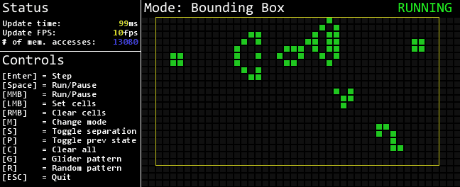

# Python Cellular Automaton
Implementation of cellular automaton in python using pygame (mainly Conway's Game of Life)

## Projects so far:                                         
* **GOL**  
	- Conway's Game of Life, developed to test speed of various cell update modes
	- Simple mode: all cells are updated
	- Bounding Box mode: The bounding box of the live cells is calculated and only cells within it are updated (faster)
	- Active Cells mode: only the cells around the active cells are updated (work in progress)
	- Controls:
		- `Enter` = Step
		- `Space` = Run/Pause
		- `MMB`   = Run/Pause
		- `LMB`   = Set cells
		- `RMB`   = Clear cells
		- `M`     = Change mode
		- `S`     = Toggle separation
		- `P`     = Toggle prev state
		- `C`     = Clear all
		- `G`     = Gosper glider gun pattern
		- `g`     = Glider pattern
		- `R`     = Random pattern
		- `ESC`   = Quit
	
	GIF is current as of commit [dc9ffef](https://github.com/vacer25/Python-Cellular-Automaton/commit/dc9ffef7029ecb17e3b6dfedc4ac441552ed8df3)
	 
	