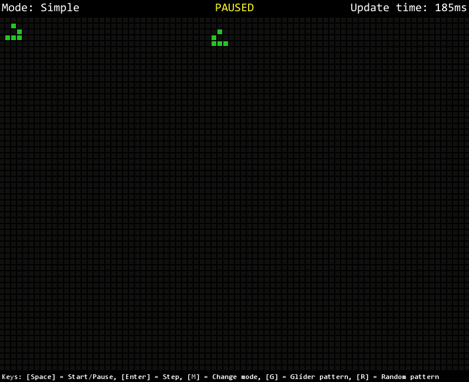

# Python Cellular Automaton
Implementation of cellular automaton in python using pygame (mainly Conway's Game of Life)

## Projects so far:                                         
* **GOL**  
	- Conway's Game of Life, developed to test speed of various cell update modes
	- Simple mode: all cells are updated
	- Bounding Box mode: The bounding box of the live cells is calculates and only cells within it are updated (faster)
	- Active Cells mode: only the cells around the active cells are updated (work in progress)
	- Controls:
		- `SPACE` = Start/Pause
		- `ENTER` = Step
		- `M` = Change mode
		- `G` = Glider pattern
		- `R` = Random pattern

	
	GIF is current as of commit [a96aa46](https://github.com/vacer25/Python-Cellular-Automaton/commit/a96aa469970c304a433bc85ae8e92ec909bb53a1)
	 
	